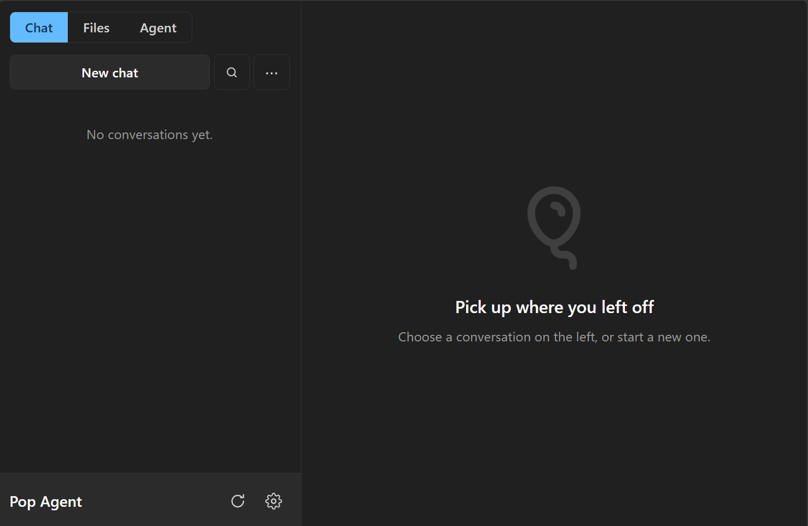
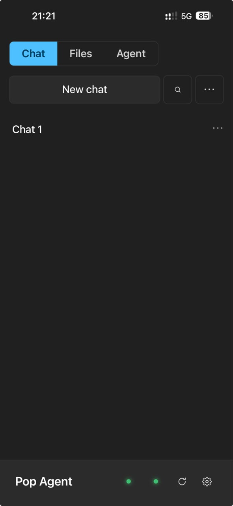
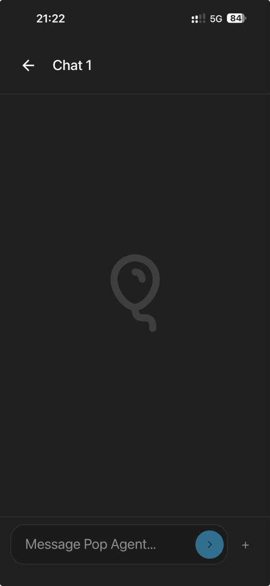

# Pop Agent

A personal, self-hosted AI agent. Install it on your server, connect it to your
Tailscale VPN, add your LLM provider, and start chatting.

It is available through:

- **Web browser**
- **Desktop:** Windows, Linux, and macOS via PWA
- **Mobile:** Android and iPhone via PWA
- **CLI:** Windows, Linux, and macOS

The PWA also works with **Pop Local Access**, an optional companion that lets
the agent access files and run commands on a computer you explicitly enable.



[Install](#install) · [What's included](#what-is-included) · [Documentation](#documentation) · [Contributing](CONTRIBUTING.md)

## Why it exists

Pop Agent started as a learning project. I wanted to understand how an AI agent
works. It has since become my main personal agent, and I'm very happy with how
far it has come.

I use it every day. It is still **beta (pre-1.0)**, and some ideas are still
being tested and improved.

## Product decisions

Pop Agent is built around four decisions:

1. **One conversation across clients.** Start a chat in your browser, continue
   it on your phone, and reopen it in the CLI.
2. **Multiple LLM providers.** Choose your provider and model, switch models
   per conversation, and configure provider failover.
3. **Your data stays under your control.** Conversations, memory, files, notes,
   skills, schedules, usage records, and provider credentials live
   on your server.
4. **"Infinite" memory through searchable history.** Past conversations remain
   available for the agent to search and revisit unless you delete them. It
   retrieves relevant history as needed; this does not mean unlimited model
   context or perfect recall of every detail.

## What is included

- **Skills:** reusable instructions, including Agent Skills directories with
  a `SKILL.md` file. Add your own or manage them in the app.
- **File storage:** share files and folders with the agent, edit text, preview
  documents, and recover deleted files from the trash.
- **Memory and Notes:** searchable conversation history, a personal memory
  document, and a private Markdown notes vault.
- **Scheduled tasks:** ask the agent to do work on a schedule.
- **Voice input:** transcribe voice notes on your server.
- **MCP Client:** connect to remote MCP servers or local stdio servers.
- **Agent to Agent:** A2A Client and Server for communicating with other agents.
- **REST API:** Client and Server for connecting other software.
- **SQLite storage:** persistent conversation and application data, with
  encrypted storage for API keys and other values in its secrets store.

The SQLite database as a whole is **not encrypted**. Keep your server and
backups protected. Save your password and the recovery key shown during setup;
the recovery key lets you reset a forgotten password.

## Auto-Skill and Skill Router

Auto-Skill and the Skill Router are two ideas I'm experimenting with in Pop
Agent. They still need improvement.

**Auto-Skill** can automatically create reusable skills from your conversations.
It looks for procedures worth keeping, checks for duplicates, and reviews
candidates before making them available. You can disable automatic learning
and edit or remove the skills it creates.

**The Skill Router** uses a small, local retrieval process — a kind of mini-RAG —
to select relevant skills for the current request. It combines keyword and
semantic search, adding only selected skills to the context instead of loading
the whole collection. Selection itself does not require an LLM call.

The idea is to help the agent become more useful as you talk to it normally,
while keeping its context focused.

## On iPhone

The conversation list and chat view adapt to the smaller screen.

<p>
  
  
</p>

## Built on pi

Pop Agent embeds **pi agent** (`@earendil-works/pi-coding-agent`) directly in
its server process through the TypeScript SDK. Pi provides agent execution,
sessions, and context compaction. Pop connects providers, tools, and selected
context through its infrastructure adapter, using pi's supported APIs.

Pop owns authentication, application data, integrations, and the web and CLI
experience. The execution engine runs on the server; your browser and terminal
connect to that same personal agent.

The application is a TypeScript monorepo with a React frontend and SQLite
storage. Small Go programs provide the client launcher and Local Access tray.
See the [architecture and specification index](docs/specs/Spec-Pop-General.md).

## Your server, your data

Conversations, files, memory, and provider credentials live on your server.
API keys in Pop's secrets store are encrypted at rest. Provider sign-in tokens
managed by pi are stored in an unencrypted, owner-only file. Pop Agent has no
telemetry and is permanently single-user.

Self-hosting does not make the language model local: requests and relevant
context are sent to your selected provider. Connected tools and integrations
may also exchange data with their configured services.

Remote access uses private HTTPS through Tailscale. REST API and A2A servers
start disabled on fresh installations; each has its own access key and IP
allowlist. Incoming A2A requests can invoke the tools available to your agent.

## Install

You need:

- **Ubuntu 24.04 or newer**, with systemd, on **amd64 / x86-64**;
- a non-root account with `sudo`, Git, and outbound internet access;
- Tailscale on the device you will use to access Pop;
- a supported model provider account or API key.

Run on the Ubuntu server:

```sh
git clone --depth 1 https://github.com/viniciusbuscacio/pop-agent.git
cd pop-agent
./deploy/bootstrap-server.sh --install-apt-packages
```

If the repository is private, complete the
[GitHub authentication steps](deploy/README.md#private-repositories) before cloning.

The installer downloads a verified prebuilt release and the managed Node and
Whisper runtimes, installs missing prerequisites and Tailscale, and starts the
service. An audio-only FFmpeg binary is included. Normal installation does not
compile the project or run the full development test suite.

Installation shows concise progress. Press **D** for detailed output; the full
installation log path is printed for troubleshooting.

### Finish in your browser

1. Open the private-LAN setup URL printed by the installer and enter its
   one-time code.
2. Connect the server to Tailscale. Keep your browser device on the same tailnet.
3. Follow the setup flow to the private HTTPS address, create your password,
   and save the recovery key.
4. Connect a model provider and start a conversation.
5. Optionally install the PWA and CLI from **Settings → Installation**.

The setup code lasts 15 minutes. Generate another on the server with:

```sh
popman onboarding-code
```

The app listens on `127.0.0.1:8787` behind Tailscale Serve. The temporary setup
page uses `http://<private-LAN-IP>:8788/setup`; passwords are created only after
moving to HTTPS. Do **not** expose port 8787 directly.

Data defaults to `~/.pop-agent`, and the agent workspace to
`~/pop-agent-workspace`. Create a backup after setup and protect `secret.key`
separately: it is intentionally excluded from backup archives.

Conversations, files, notes, and pi-managed provider sign-in tokens are not
encrypted by Pop Agent. They rely on filesystem access permissions. Use disk
encryption on the Ubuntu server (for example, LUKS) to protect data at rest.
New backups are encrypted with a separate **backup password**, configured in
Settings → Backup and saved encrypted for reuse. Keep that password elsewhere:
restoring requires the password used when the archive was created. Older
`.tar.gz` backups remain unencrypted and can include provider sign-in tokens.
Protect those legacy archives during storage and transfer.

For custom paths, network setup, logs, and installation recovery, see the
[deployment guide](deploy/README.md).

## Current limits

- The supported server distribution is Ubuntu amd64. There is no packaged
  Windows server, Docker distribution, or ARM64 release.
- Each installation has one owner. Multi-user accounts and hosted cloud sync
  are outside the project scope.
- Model subscriptions, API charges, and provider availability are separate
  from Pop Agent.
- Files uploads allow 100 MiB per file. Chat supports up to eight attachments,
  25 MiB each and 100 MiB combined; voice notes are limited to 25 MiB.
- A2A Server currently supports text tasks without protocol streaming, file
  exchange, or push notifications. Continuing a completed A2A conversation is
  supported by the server protocol but is not yet exposed by the client UI;
  its Continue action handles tasks waiting for more input.
- Beta updates can include compatibility changes. Read the
  [changelog](CHANGELOG.md) and keep backups. See the [support policy](SUPPORT.md).

## Development

Development requires Node.js `>=22.19.0`, npm, Go `>=1.23`, Git, and the native
build tools required by the locked dependencies.

```sh
npm ci
npm run build
dev_root=$(mktemp -d)
POP_AGENT_DATA_DIR="$dev_root/data" \
  POP_AGENT_WORKSPACE="$dev_root/workspace" \
  npm run dev
```

For live frontend development, use a second terminal:

```sh
npm run dev -w @pop-agent/web
```

The full validation gate runs locally before a release batch is published:

```sh
npm run gate
```

Read [CONTRIBUTING.md](CONTRIBUTING.md) before making a change. Report reproducible
bugs through GitHub Issues; report vulnerabilities privately using
[SECURITY.md](SECURITY.md).

## Documentation

- [Installation and deployment](deploy/README.md)
- [CLI and Pop Local Access](docs/cli.md)
- [MCP compatibility](docs/mcp.md)
- [REST API Server and Client](docs/specs/Spec-Pop-REST-API.md)
- [A2A Server and Client](docs/specs/Spec-Pop-A2A.md)
- [Security model](docs/specs/Spec-Pop-Security.md)
- [Architecture and specification index](docs/specs/Spec-Pop-General.md)
- [Updates and distribution](docs/specs/Spec-Pop-Installation.md)
- [Maintainer release guide](docs/RELEASING.md)
- [Third-party notices](THIRD_PARTY_NOTICES.md)

## License

[MIT](LICENSE) © 2026 Vinicius Buscacio.
